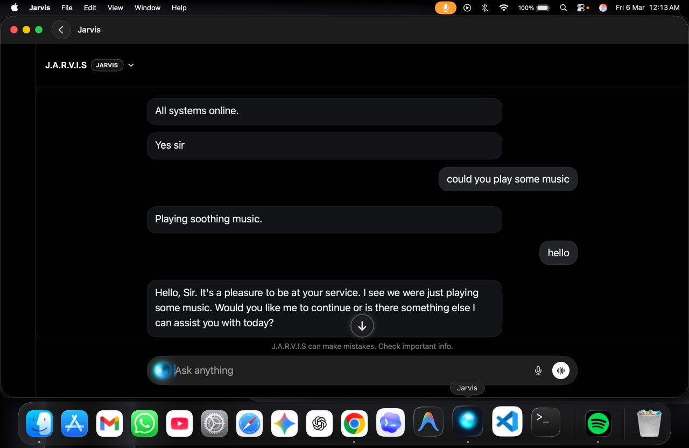
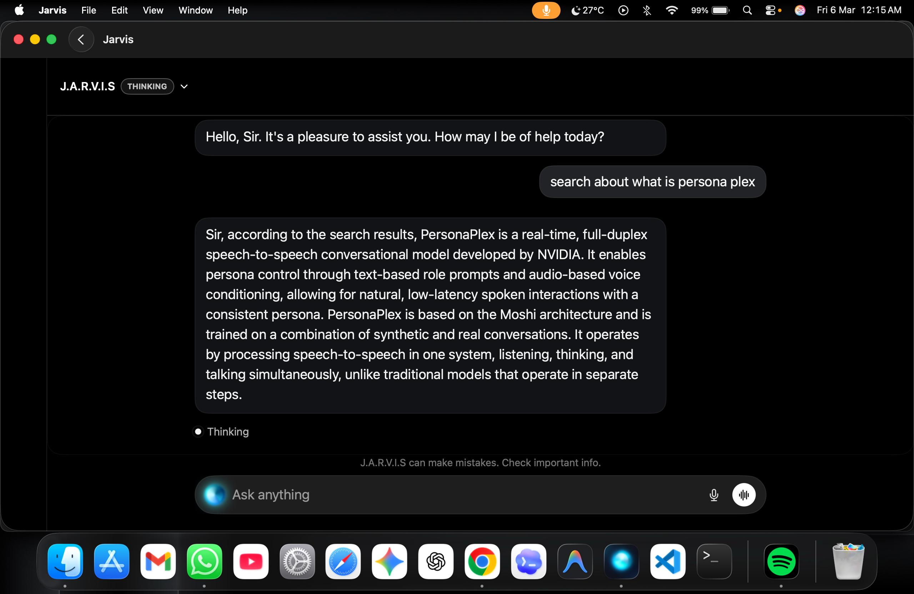
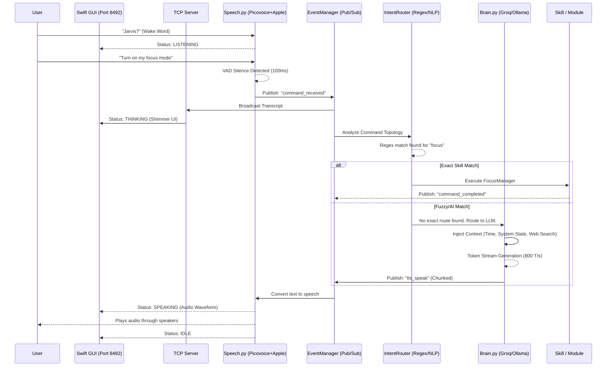

# Jarvis

### Production-Ready Local AI Assistant Stack for macOS

[](https://github.com/Sam-06060/jarvis-assistant)
[](https://www.python.org/)
[](https://swift.org/)
[](LICENSE)
[](https://github.com/Sam-06060/jarvis-assistant/issues)


Jarvis is a powerful, extensible, and privacy-focused AI assistant built natively for macOS. It combines an ultra-fast local voice engine, on-device biometric security, and a online-first LLM brain to deliver an "Iron Man" style assistant experience. Featuring a robust Python backend and a native Swift UI desktop client connected via a Socket API, Jarvis executes highly complex "Nuclear" skills—from autonomously bootstrapping entire codebases to mimicking physical workflows. Your AI, your machine.

[Quick Start](#installation--quick-start) ·
[View Architecture](#-system-architecture-flow) ·
[Report Issue](https://github.com/Sam-06060/jarvis-assistant/issues)

<p align="center">
  
  &nbsp;
  
</p>

---

## Why Jarvis?
- **Ultra-Fast Voice Engine**: Sub-200ms latency using hybrid Apple Speech Recognition and local Faster Whisper fallback. VAD optimized for instant conversational gaps.
- **Privacy & Security First**: Online-first processing architecture. can load LLM locally on-demand and offline. Features FaceID biometric authentication before executing sensitive commands.
- **"Nuclear" Capabilities**: Includes Architect Mode (project scaffolding), The Mimic (macro recording/playback), Content Assassin (YouTube/media summarization), and Dead Drop (secure file hand-offs).
- **Gesture Control**: Built-in webcam hand-gesture tracking to control the macOS cursor.
- **Extensible Architecture**: Modular "Skill" systems operating through a central Service Registry and Event Manager.

---

## Table of Contents
- [Features Overview](#features-overview)
- [Use Cases](#use-cases)
- [Nuclear Capabilities](#nuclear-capabilities)
- [Voice & AI Architecture](#voice--ai-architecture)
- [Security: FaceID](#security-faceid)
- [Installation & Quick Start](#installation--quick-start)
- [Deep Dive Documentation (Phases 1-15)](#deep-dive-documentation)
- [System Architecture Flow](#-system-architecture-flow)
- [Custom Skill Development Guide](#-custom-skill-development-guide)
- [Complete Configuration Reference](#-complete-configuration-reference-configpy)
- [Troubleshooting & FAQ](#troubleshooting)

---

---

## Features Overview

| Feature | Description |
|---------|-------------|
| **Voice Engine** | Hybrid Apple STT + Whisper fallback. <200ms latency with 100ms VAD detection. |
| **AI Brain** | online execution via Ollama (Llama 3.3) + fallback/complex routing via Groq/OpenRouter. |
| **FaceID Auth** | Local biometric facial recognition required for secure commands (e.g., shutdown, delete). |
| **Smart Web Search** | AI-powered sub-500ms intent classifier determines if external factual data is needed. |
| **Gesture Cursor** | Control your Mac with hand signs (Point, Pinch, Fist, Peace). |
| **Swift HUD** | Native macOS frontend communicating via TCP port `8492` sockets. |
| **Automation** | System volume, brightness, Apple Music/Spotify, focus modes, and dynamic audio ducking. |
| **Offline Mode** | Core functionality runs completely off-grid without internet dependencies. |

---

## Use Cases

### For Software Engineers
- **Instant Project Scaffolding:** Use Architect Mode to generate entire Python projects, complete with `main.py`, `requirements.txt`, and virtual environments, completely hands-free.
- **Rubber Duck Debugging:** Talk through complex logic verbally while Jarvis uses the Ollama Llama 3.2 engine to provide local, private code analysis.

### For Power Users & Creators
- **Physical Automation:** Use *The Mimic* to record a complex series of mouse movements and keystrokes (like formatting a spreadsheet), and play it back at 2x speed.
- **Media Summarization:** Feed Jarvis a YouTube URL; *Content Assassin* will extract the subtitles and build a comprehensive Markdown summary of the video.

### For Privacy Advocates
- **Zero-Cloud Execution:** Keep your data on your machine. Jarvis's core brain and voice engine operate completely offline.
- **Biometric Security:** *FaceID* ensures that destructive commands (like system shutdown or file deletion) are strictly executed only when you are physically recognized by the webcam.

---

## Nuclear Capabilities
These advanced skills elevate Jarvis beyond a standard voice assistant:

### 🏗️ Architect Mode
Autonomously builds entire codebases. Ask Jarvis to *"Build a Snake game in Python"*, and it will:
- Scaffold complete project folders.
- Write functional `main.py` and `requirements.txt`.
- Launch the application programmatically.

### 🎭 The Mimic
Advanced macro recording and playback.
- **Command:** *"Watch this"* starts recording mouse clicks, movements, and keystrokes.
- **Command:** *"Mimic recent macro"* replays the exact sequence at 1x, 2x, or 0.5x speed.

### 🎓 Content Assassin
Deep video and media intelligence.
- Instantly downloads YouTube subtitles from a provided URL.
- Utilizes the LLM to generate clean, formatted markdown study notes and content summaries.

### 📡 Dead Drop
Secure, ephemeral data hand-off.
- Uploads specified Finder files to secure ephemeral hosts (Oshi.at, PixelDrain).
- Generates a terminal QR code for instant, seamless mobile downloads.

---

## Voice & AI Architecture

### Speech Processing
- **Primary:** Apple's native macOS Speech Recognition framework (forced on-device processing).
- **Fallback:** Faster Whisper (optimized for CPU/int8). Loads lazily only if Apple STT fails.
- **Audio Ducking:** Automatically lowers system media volume while listening and speaking.

### The Brain
- **Online Priority:** Heavy reliance on online Ollama models (e.g., `llama-70b versatile`) for context and chat.
- **Cloud Escalation:** High-complexity tasks (code generation, heavy intent routing) are dynamically routed to Groq (`llama-3.3-70b-versatile`) or OpenRouter to ensure maximum intelligence without blocking the main event loop.

---

## Security: FaceID
Jarvis utilizes an integrated FaceID module for zero-trust local execution.
- **Reference Image:** Set your face in `data/me.jpg`.
- **Trigger:** When destructive or high-security commands are detected (e.g., *"Lock my screen"*, *"Shut down"*), Jarvis activates the webcam.
- **Verification:** Uses the `face_recognition` library to process biometrics locally. Execution is denied if unrecognized.

---

## Core Productivity Skills
- **System Control:** Manage Spotify, Chrome, Focus Mode, brightness, and volume.
- **Scheduling & Alarms:** Native macOS Clock integration, Reminders, and Calendar event parsing.
- **Communications:** Read and send emails, manage Contacts.
- **Utilities:** Natural language math calculator, real-time weather, news fetching, and text translation.

---

## Installation & Quick Start

### System Requirements
- **OS:** macOS 13+ (Apple Silicon recommended for optimal AI performance)
- **Runtime:** Python 3.10+ (3.11 recommended)
- **Tools:** Xcode Command Line Tools (`xcode-select --install`)

### 1) Clone the Repository
```bash
git clone https://github.com/Sam-06060/jarvis-assistant.git
cd jarvis-assistant
```

### 2) Bootstrap Environment
The bootstrap script automatically creates your virtual environment, installs Python dependencies, and prepares directories.
```bash
# Standard runtime
./scripts/bootstrap_macos.sh

# With developer tools
./scripts/bootstrap_macos.sh --dev
```

### 3) Configuration
Copy the template and edit your API keys.
```bash
# Rename template if the script didn't already
cp .env.example .env
```
Edit `.env` and configure:
- `PICOVOICE_API_KEY`: Required for the wake word engine. (Get at [Picovoice Console](https://console.picovoice.ai/))
- `OPENROUTER_API_KEY` / `GROQ_API_KEY`: Required for advanced cloud LLM queries.
- `REFERENCE_IMAGE_PATH`: Path to your security photo for FaceID.

### 4) Preflight Doctor Check
Run the built-in diagnostic tool to ensure everything is perfect before first boot.
```bash
.venv/bin/python scripts/doctor.py --strict
```

### 5) Build App & Launch
Compile the Swift frontend and fire up the system.
```bash
# Build the native macOS HUD
cd JarvisApp
./build_app.sh
cd ..

# Start the Python Backend + Swift App
./start_jarvis.sh
```

---

## Technical Details

### Backend Architecture
- **Language:** Python 3.11
- **Design Pattern:** Service-oriented. Core processes (Speech, Brain, Files) register with a centralized `ServiceRegistry`.
- **Concurrency:** Threaded listener and isolated worker loops. Heavy IO plugins (like models) use Lazy Loading via `ServiceProxy` to guarantee instant start-up.
- **IPC:** Communicates with the Frontend via a custom Socket Server on port `8492`.

### Frontend Architecture
- **Language:** Swift 5
- **UI:** Custom borderless floating window HUD.
- **Responsibilities:** Receives state telemetry (IDLE, LISTENING, PROCESSING) and displays real-time subtitles and system feedback.

---

## Deep Dive Documentation

<details>
<summary><b>Phase 1: Core System Architecture & Event Loop</b></summary>
<br>

*Reference Files:* `jarvis.py`, `core/registry.py`, `core/events.py`, `core/proxy.py`

#### 1. Central Service Registry (`core/registry.py`)
Instead of having one giant main file that controls everything and gets messy over time, Jarvis uses a `ServiceRegistry`. 
- **How it works:** When a new system part starts up (like the speech engine or the AI brain), it "registers" itself here. 
- **Why it matters:** If the speech engine needs to talk to the AI brain, it doesn't need to be hard-coded to find it. It just asks the registry, "Hey, can you give me the brain?" This makes the code very clean, easy to update, and if a part crashes, Jarvis can just restart that specific part without breaking the whole system.

#### 2. Fast Startup with Smart Proxies (`core/proxy.py`)
Jarvis is designed to start up instantly, just like the built-in Mac dictation. 
- **How it works:** To boot up fast, Jarvis doesn't load heavy features (like the Music Controller, Alarms, or Calculator) right away. Instead, it puts a lightweight "Smart Proxy" in their place.
- **Why it matters:** These proxies secretly load the real, heavy features in the background while Jarvis is already listening to you. If you ask Jarvis to do something before the background loading is finished (like asking for the weather right as you open the app), the proxy kindly tells you: *"One moment sir, the Weather Service is still loading."* This prevents the app from freezing or crashing.

#### 3. The Event Manager (`core/events.py`)
Jarvis has an internal messaging system called the `EventManager`.
- **How it works:** Imagine a radio station. One part of the code can broadcast a message (like "The system health has changed!"), and any other part of the code that cares about system health can tune in and listen.
- **Why it matters:** This means different parts of the code don't have to be tied together directly. They just listen for announcements, which keeps the system fast and flexible. 

#### 4. The Main Brain Loop (`jarvis.py`)
The `JarvisApp` is the main engine running the whole show. It runs in a continuous loop, cycling between IDLE (waiting), LISTENING, and PROCESSING.

**A. Getting Ready:**
When you first start Jarvis, it quickly checks to make sure it has permission to use your Mac's microphone, camera, and other settings. It also starts a connection to talk to the graphical desktop app (the Swift HUD).

**B. Waiting for You:**
While Jarvis is IDLE, it uses almost 0% of your computer's power. It patiently waits for either a typed message from the desktop app or for you to speak the wake word.
- **Audio Ducking:** The moment Jarvis hears its name, it automatically lowers your Mac's volume and pauses your music so it can hear you clearly. 
- **FaceID Check:** Before it does anything dangerous (like shutting down your Mac), it can quickly check the webcam to make sure it's actually you giving the command.

**C. The Safety Net (Interrupt Guard):**
This is the most important part of the main loop. It allows you to interrupt Jarvis at any time.
- **How it works:** When Jarvis starts performing a long task (like generating code using cloud AI), it puts that heavy work in the background. Meanwhile, the main system keeps a specialized ear open.
- **Why it matters:** If you say "Jarvis, stop" or hit the emergency kill switch, Jarvis instantly throws away the background work, stops talking, and immediately goes back to waiting for your next command. It never gets "stuck" thinking.

</details>

<details>
<summary><b>Phase 2: Voice Engine Deep Dive</b></summary>
<br>

*Reference Files:* `modules/speech.py`, `utils/audio_manager.py`

#### 1. The Super-Fast Hybrid Ear (`modules/speech.py`)
Jarvis uses a "Hybrid" approach to listening and speaking to be as fast as possible.
- **How it works:** Instead of relying entirely on heavy offline models that drain battery, Jarvis secretly uses Apple's built-in macOS Dictation engine to convert your speech to text. 
- **Why it matters:** Apple's engine is incredibly fast (under 200 milliseconds to understand you). However, if Apple's engine fails or doesn't understand your accent, Jarvis has a backup plan: it instantly switches to "Faster Whisper," a completely offline AI model that guarantees it will understand you, even without the internet.

#### 2. Knowing When You Stop Talking (VAD)
When you talk to most voice assistants, you have to wait a second or two after you finish speaking before they realize you are done. Jarvis uses Voice Activity Detection (VAD).
- **How it works:** Jarvis is tuned to detect silences as short as 100 milliseconds. 
- **Why it matters:** The millisecond you stop speaking, Jarvis immediately starts processing your command without any awkward pauses, making conversations feel highly natural and snappy. It's smart enough to filter out fans, humming, and other background noises so it doesn't accidentally trigger.

#### 3. Smart Audio Mixing (`utils/audio_manager.py`)
Nothing is more annoying than an assistant that tries to talk over your loud music. Jarvis handles your Mac's audio dynamically.
- **How it works:** When you say "Jarvis," the `audio_manager.py` instantly scans your Mac to see what is making noise. Is Spotify open? Is Apple Music playing? Is a YouTube video playing in background tabs on Safari or Chrome?
- **Why it matters:** Jarvis uses hidden AppleScripts and JavaScript to physically turn down the exact app making the noise (`duck_audio()`). It won't lower your Mac's master volume (which would make Jarvis's own voice too quiet to hear), but it will perfectly lower Spotify so you can chat. When the conversation is over, it returns your music to the exact volume it was at before!

<details>
<summary><b>Phase 3: The AI Brain & Multi-Model Routing</b></summary>
<br>

*Reference Files:* `modules/brain.py`, `modules/groq_client.py`, `modules/conversation_history.py`

#### 1. The Zero-Heat Cloud Brain
Jarvis uses a "Cloud-First" approach for standard conversations so it never slows down your Mac.
- **How it works:** When you ask a normal question, Jarvis secretly sends it to ultra-fast cloud servers (like Groq or OpenRouter) running massive AI models like Llama 3.3. 
- **Why it matters:** Your Mac's fans will never turn on. You get the intelligence of a massive supercomputer, but it happens so fast (often under 1 second) that it feels like the brain is running locally.

#### 2. The Local Fallback Brain
What happens if your internet goes out or the cloud servers crash?
- **How it works:** Jarvis has a built-in safety net. It will automatically switch to "Local Mode" and use Ollama (running Llama 3.2 directly on your Mac's chip).
- **Why it matters:** This ensures Jarvis is *always* available to help you, even if you are on an airplane with no Wi-Fi. It will gracefully switch back and forth depending on your connection.

#### 3. Giving the AI a Memory (`modules/conversation_history.py`)
AI models traditionally don't remember what you said 5 minutes ago. Jarvis fixes this.
- **How it works:** Every time you talk to Jarvis, the `ConversationHistory` module saves a tiny text log. Before sending your *new* question to the AI, Jarvis secretly injects the last 5 things you talked about into the background code (`self._build_system_prompt()`).
- **Why it matters:** This makes conversations flow naturally. If you say "Who is Elon Musk?" and Jarvis answers, you can follow up with "How old is he?". Because Jarvis injected the memory of the last message, the AI knows exactly who "he" is.

</details>

<details>
<summary><b>Phase 4: Command Processing & Intent Recognition</b></summary>
<br>

*Reference Files:* `modules/commands.py`, `utils/fuzzy_matcher.py`

#### 1. The Skill Hierarchy (`modules/commands.py`)
When you speak to Jarvis, your words don't just go to the AI. They pass through a strict filter of "Skills". 
- **How it works:** Jarvis has a prioritized list of over 20 skills. For example, the `InteractionSkill` (handling commands like "Stop" or "Shut down") is at the very top. The `CalculatorSkill` is in the middle. The `AIBrain` is at the very bottom.
- **Why it matters:** If you say "Stop listening", the `InteractionSkill` instantly catches it and shuts down the microphone faster than the AI could ever process the text. This hierarchy makes Jarvis incredibly fast for everyday tasks, while still letting it use the AI for complex questions.

#### 2. The Smart Intent Engine
Sometimes, it's hard to tell if you are asking a question or giving a command.
- **How it works:** Before any skill runs, Jarvis passes your words through a fast NLP (Natural Language Processing) engine called the `IntentRouter`. It gives your command a mathematical "confidence score." 
- **Why it matters:** If you say "Build me a new login screen", a standard assistant might just tell you what a login screen is. But Jarvis's Intent Engine recognizes the *intent* to create software (scoring 90%+ confidence) and automatically routes your command to the powerful "Architect Mode" instead of just answering the question.

#### 3. The "Fuzzy" Forgiveness System (`utils/fuzzy_matcher.py`)
Humans make mistakes, and microphones sometimes mishear words. Jarvis is designed to be forgiving.
- **How it works:** If you say "Open Crome" instead of "Google Chrome", the `FuzzyMatcher` kicks in. It compares your broken command against a massive dictionary of known apps and commands, looking for a match that is at least 70% similar.
- **Why it matters:** You don't have to speak like a robot. You can mumble "play spotfy" or "open my calender", and Jarvis will automatically fix the typo in the background and execute the correct command without complaining that it didn't understand you.

</details>

<details>
<summary><b>Phase 5: Security Architecture & FaceID</b></summary>
<br>

*Reference Files:* `modules/security.py`, `utils/permission_checker.py`

#### 1. Zero-Trust FaceID Authentication (`modules/security.py`)
Because Jarvis has deep access to your Mac, certain commands (like "Shut Down" or "Restart") are highly dangerous if a guest uses them.
- **How it works:** When Jarvis detects a dangerous command, it refuses to run it immediately. Instead, it silently snaps a photo using your Mac's webcam and compares it mathematically to a secure reference photo (`data/me.jpg`) you provide.
- **Why it matters:** If your friend walks into the room and yells "Jarvis, sleep my Mac!", Jarvis will scan their face, realize it's not you, say "Access Denied," and completely ignore them.

#### 2. The Auto-Flash System
FaceID is great, but webcams struggle in the dark.
- **How it works:** When FaceID turns on, Jarvis instantly checks the "brightness level" of the webcam feed. If the room is completely dark (brightness under 60%), Jarvis uses AppleScripts to instantly crank your Mac's screen brightness to 100% and displays a pure white window to illuminate your face.
- **Why it matters:** It acts exactly like a smartphone's FaceID flash, ensuring you can authenticate and lock your screen even in a pitch-black room. When the scan finishes, Jarvis safely returns your screen brightness to normal.

#### 3. The Polite Permission Doctor (`utils/permission_checker.py`)
To work properly, Jarvis needs 10 different macOS permissions (Microphone, Camera, Accessibility, etc.). Usually, apps spam you with 10 error popups at once.
- **How it works:** Jarvis has a built-in "Doctor." Every time it turns on, it quietly checks all 10 permissions in the background without triggering any annoying macOS alerts.
- **Why it matters:** It only bothers you if something is *actually* broken. If it finds you are missing exactly 1 permission (like Contacts), it prints a beautiful terminal checklist showing 9/10 permissions are good, and then cleanly opens *only* the specific Apple Settings page you need to fix.

</details>

<details>
<summary><b>Phase 6: Nuclear Skill - Architect Mode</b></summary>
<br>

*Reference Files:* `modules/skills/architect_skill.py`

When you ask a normal voice assistant to "build a weather app," it will probably just read you a Wikipedia article about weather apps or give you a short 10-line Python script that barely works. Jarvis doesn't do that.

Jarvis features a "Nuclear Skill" called **Architect Mode**. When triggered, Jarvis completely shifts from being a conversational assistant into becoming a fully autonomous Software Engineer. It designs the architecture, writes the code, structures the file system, and saves a ready-to-run folder directly to your Desktop.

This module (`architect_skill.py`) is one of the most complex in the entire system, featuring a robust multi-stage pipeline designed to guarantee that the code it generates actually works, rather than just looking good on paper.

#### 1. The Intelligent Trigger & Intent Routing
How does Jarvis know when to just answer a question vs. when to build an entire application?
- **How it works:** If you say "How do I build a website?", Jarvis will simply have a conversation with you. But if you use high-intent phrases like "Build an app," "Make a project," or "Scaffold a dashboard," the NLP Intent Engine instantly routes your request to Architect Mode. It explicitly ignores trigger words if they are mixed with other commands (like "Make an alarm," which goes to the Alarm Skill).
- **Why it matters:** You don't have to use special robotic wake words like "Enter Developer Mode." You just talk naturally, and Jarvis uses mathematical confidence scores to understand when you want it to act as a programmer.

#### 2. The Multi-Stage Generation Pipeline
Standard AI models are notoriously lazy. If you ask them to build a large feature, they will often write `// ... rest of the code here ...` to save time. Jarvis fights this laziness using a rigorous pipeline.
- **Stage 1: Strict Formatting (`<file>` tags).** Jarvis forces the AI to output exactly one thing: raw XML code. It uses `<file name="index.html">` tags to separate out the HTML, the CSS, and the JavaScript.
- **Stage 2: The Stub Check.** Before saving anything to your Mac, Jarvis scans the generated code. If it finds any "stubs" (files smaller than 20 characters, or with the text `...`), the build is immediately paused.
- **Stage 3: Multi-Pass Generation.** If stubs were detected, Jarvis abandons the single-pass approach. Instead, it reads the names of the files that the AI *intended* to create, and loops back to the AI, asking it to generate *every single file individually*. It even passes the previously generated files into the prompt as context, so the CSS perfectly matches the HTML.
- **Why it matters:** This ensures every single file in your project is 100% complete and ready for production, saving you from having to manually fill in the blanks the AI left behind.

#### 3. God Mode (Context Recovery & Iteration)
Building software is rarely a one-shot process. Usually, you need to make changes after seeing the first version.
- **How it works:** Every time Jarvis builds a project, it creates a new folder in `~/Desktop/Jarvis_Builds/` (e.g., `Weather_App_20260301`). It remembers this path! If you look at the app and say, "Jarvis, change the background to dark blue and make the text bigger," Jarvis automatically scans that entire folder, reads all the existing `HTML/CSS/JS` files, and sends them back to the AI as "Previous Context."
- **Why it matters:** You can build, refine, and polish software entirely through conversation. It feels like pair-programming with a real human who remembers exactly what you are both working on.

#### 4. Safe & Atomic Folder Versioning
What happens if you ask for an update, and the AI makes a mistake that ruins your perfectly good code?
- **How it works:** Jarvis never overwrites your previous work directly. If you are iterating on a project, Jarvis performs an "Atomic Copy" of the entire folder (e.g., creating `Weather_App_v2`).
- **The Strict Snippet Guard:** Before writing the new code to the new version folder, Jarvis counts the characters. If the new file is less than 50% the size of the old file, Jarvis assumes the AI made a mistake and tried to give you a "snippet" instead of a full file. It blocks the update, prevents code loss, and saves the broken snippet as a `.snippet` file for your review.
- **Why it matters:** You can confidently ask Jarvis to make bold changes, knowing that your previous, working version is always safely preserved.

#### 5. Dynamic Design Standards
We didn't want Jarvis building websites that look like they belong in 1999.
- **How it works:** When generating UI, Jarvis secretly injects high-end design requirements into the AI's system prompt. It explicitly forbids "fixed widths" (like `width: 400px`) and demands fluid, scalable layouts using `clamp()`, `rem`, `vw`, and CSS Grid. It also automatically pulls in CDNs for modern libraries like Tailwind CSS, GSAP, or FontAwesome.
- **Intelligent Asset Replacement:** If the AI is lazy and uses empty image tags like `` or a broken placeholder, Jarvis intercepts it before saving and automatically replaces it with a beautiful, random image from Unsplash (`source.unsplash.com`).
- **Why it matters:** The code doesn't just work—it looks professional, scales to any device size, and is visually engaging from the very first second it opens in your browser.

#### 6. Project Manifests (`jarvis_manifest.json`)
Jarvis acts like a neat developer tracking its own work.
- **How it works:** Inside every project folder, Jarvis generates a hidden `jarvis_manifest.json` file. It records the date, the exact voice command you used, and automatically analyzes the files to figure out what "stack" it used (e.g., `web_vanilla`, `node_js`, `python`).
- **Why it matters:** If you come back to the project a week later and ask for an update, Jarvis reads this manifest. If it sees the project is built in React, it forces the AI to stick to React, ensuring the technology stack doesn't accidentally change halfway through development.

#### 7. Local Fallback & Syntax Repair
Even the smartest cloud AIs sometimes output invalid code.
- **Ollama Repair Protocol:** If the cloud AI puts code outside the `<file>` XML tags, standard code parsers would normally crash. Before giving up, Jarvis sends the broken mess to its local brain (Ollama) with the strict instruction: "Fix these XML tags." The local brain repairs the formatting so the build can continue.
- **Syntax Validation:** Before saving a `.py` Python script, Jarvis runs an AST (Abstract Syntax Tree) check. Before saving `.js` or `.css` files, it checks for basic errors like unbalanced curly braces `{}` or parentheses `()`. If an error is found, Jarvis automatically asks the AI to repair the syntax.
- **Why it matters:** You consistently get functioning codebase outputs, even if the AI hallucinates bad syntax on its first try. Jarvis acts as its own Quality Assurance tester.

</details>

<details>
<summary><b>Phase 7: Nuclear Skill - The Mimic</b></summary>
<br>

*Reference Files:* `modules/mimic.py`

While Architect Mode writes software, **The Mimic** writes automation. It is a powerful "Nuclear Skill" that allows Jarvis to physically take control of your mouse and keyboard to perform repetitive tasks on your behalf. Rather than relying on complex API integrations or fragile web scrapers, The Mimic operates exactly like a human would: by clicking buttons, dragging the cursor, and typing on the keyboard.

This means Jarvis can automate *any* application on your Mac—even older, legacy apps, terminal interfaces, or secure websites that strictly forbid developer APIs—simply by watching you do it once.

#### 1. The Multi-Threaded Recording Engine
When you instruct Jarvis to "Watch this," it enters a specialized, heightened observation state.
- **How it works:** The Mimic utilizes the `pynput` library to instantiate extremely lightweight, non-blocking background listeners for both your mouse and keyboard. Once activated, every single physical action you take is intercepted and recorded into a real-time event array in active memory.
- **What it tracks:**
    - **Mouse Movement (`on_move`):** Tracks exact X and Y coordinate translations of your cursor across the screen. To prevent massive file sizes and system memory bloat, it heavily optimizes the capture rate so it doesn't log useless micro-jitters, focusing only on meaningful cursor travel.
    - **Mouse Actions (`on_click`, `on_scroll`):** Records left, right, and middle clicks, tracking both the exact moment the button is pressed and when it is physically released. It also captures exact scroll wheel deltas, allowing Jarvis to pan up and down webpages exactly as far as you did.
    - **Keyboard Strokes (`on_press`, `on_release`):** Captures individual alphanumeric characters and special `KeyCode` events (like Shift, Command, or Option). By tracking both the strict press and release of a key, it can perfectly understand and record complex, multi-key keyboard shortcuts (like Cmd+Shift+4).
- **Why it matters:** Because the event listeners are non-blocking and deeply optimized, your Mac doesn't freeze, stutter, or slow down while you record the macro. You perform the task entirely naturally, and Jarvis quietly builds a mathematical map of your exact physical inputs in the background without you noticing.

#### 2. Relative Time Deltas (The "Delay" System)
A recorded macro is completely useless if the recorded clicks happen too fast for the computer to actually load the next window. Computers execute code in milliseconds, but humans take seconds.
- **How it works:** Instead of just recording *what* you clicked, The Mimic engine records *when* you clicked it. Every time an action is logged (like a click or a keypress), the engine calculates the exact `time.time()` differential since the very *previous* event. It attaches this precise delay to the event object.
- **Why it matters:** If you click a login button, wait exactly 3.5 seconds for a slow webpage to finish loading, and then begin typing a password, Jarvis will see that exact visual delay. During the replay, Jarvis will artificially sleep for exactly 3.5 seconds before it starts typing. This perfectly preserves the human cadence of your actions, drastically reducing the chances of a macro failing or mis-clicking due to a slow-loading UI element or a sluggish network connection.

#### 3. Persistent JSON Serialization
Once you finish demonstrating the physical task, you explicitly tell Jarvis, "Set this as Server Backup."
- **How it works:** Jarvis cleanly halts the `pynput` listener threads and immediately runs the captured event array through a custom serialization helper. Because native Python `pynput Key` objects cannot directly be saved to a standard text file, the helper converts them back into raw, parsable string formats (differentiating between standard chars and special system keys).
- **Storage:** The entire physical sequence is structurally dumped into a local folder as `macros/server_backup.json`.
- **Why it matters:** Your physical automations persist across computer reboots. You can build up an entire local library of incredibly complex workflows—like "Run Morning Server Checks", "Export Video Timeline", or "Format Weekly Report"—and they are permanently stored as lightweight, human-readable JSON files. Because they are plain text, you can even open the JSON file and manually edit the delay of a specific click if you want to perfectly optimize the timing without having to re-record the whole sequence!

#### 4. The Replay Engine & Speed Multipliers
When it's time to put Jarvis to work, you simply say "Mimic Server Backup."
- **How it works:** Jarvis reads the saved JSON file, loads the events back into memory, and boots up a dedicated `_replay_thread`. This is a crucial architectural decision: by running the physical macro in an isolated background thread, the main Jarvis voice assistant stays wide awake and completely responsive. 
- **The Magic of Speed Multipliers:** When you call the macro, you don't have to sit there and watch it run at your slow, original human speed. The `execute` function accepts a `speed_multiplier` argument (e.g., `1.5` or `0.5`). Right before executing the `time.sleep()` for the recorded delay, the engine divides the delay by your multiplier.
- **Why it matters:** You can intentionally record a slow, highly careful data-entry task at 1x speed to ensure you don't make any mistakes. Later, you can tell Jarvis to "Mimic Data Entry at double speed." Jarvis will flawlessly execute your exact clicks and keystrokes twice as fast as you ever could, physically turning hours of tedious clicking into seconds of automated background work.

#### 5. Native macOS API Obfuscation (AppKit)
There is a massive flaw with building Python apps that control your mouse: when a Python script takes control, the active Python terminal window usually jumps to the very front of your screen, physically blocking and covering up the application you are actually trying to automate.
- **How it works:** Jarvis anticipates and fixes this by digging deeply into Apple's native Objective-C APIs. Directly before executing the macro, The Mimic triggers a hidden `_hide_dock_icon()` system function. It explicitly imports macOS's native `AppKit` and forces the active `NSApplication` instance to switch its activation policy state to `NSApplicationActivationPolicyAccessory` (Value 1).
- **Why it matters:** This natively hides the Jarvis Python icon from your macOS Dock and completely removes it from the `Cmd+Tab` App Switcher. Jarvis essentially becomes a "ghost process"—it can control your mouse and keyboard smoothly without constantly asserting its own application window to the front. This allows it to seamlessly operate underlying apps like Safari, Microsoft Excel, or Final Cut Pro without any visual interruption or frustrating focus-stealing bugs.

</details>

<details>
<summary><b>Phase 8: Nuclear Skills - Content Assassin & Dead Drop</b></summary>
<br>

*Reference Files:* `modules/content_assassin.py`, `modules/dead_drop.py`

Sometimes you don't need Jarvis to write code or move your mouse; you just need it to handle digital logistics instantly. Phase 8 introduces two highly specialized "Nuclear Skills" designed for rapid information extraction and secure file sharing. 

#### 1. Content Assassin: Youtube Study Bot (`modules/content_assassin.py`)
Watching a 45-minute YouTube lecture or tutorial is incredibly time-consuming. **Content Assassin** allows Jarvis to instantly "assassinate" a video and extract its core knowledge payload in seconds.
- **The Subtitle Harvester:** Instead of trying to use a slow web-scraper or a heavy headless browser to load YouTube, Jarvis utilizes the extremely mature `yt_dlp` library. However, it explicitly suppresses downloading the heavy video and audio streams (`"skip_download": True`). It exclusively requests the raw `.vtt` (Web Video Text Tracks) subtitle file. This makes the download nearly instant.
- **The Text Cleaner:** Raw YouTube subtitles are incredibly messy. They contain timestamps like `00:01:23.400 --> 00:01:25.100`, metadata headers, HTML tags, HTML entities like `&nbsp;`, and thousands of repeated duplicate lines. The `_clean_vtt` function uses advanced Regular Expressions (Regex) to aggressively strip out all timing data, flatten the text, and remove duplicate consecutive lines caused by YouTube's auto-generated rolling captions.
- **The AI Handshake & Output:** Once the text is perfectly clean, Jarvis fires the massive block of text into the high-performance Cloud Brain (Groq). The AI summarizes the text, extracts key takeaways, and formats it beautifully. Jarvis then automatically creates a Markdown file (e.g., `Study_Notes_VideoTitle.md`) directly on your Desktop and programmatically opens it.
- **Why it matters:** You can feed Jarvis an hour-long podcast link, and in about 5 seconds, a perfectly formatted text file containing comprehensive study notes will pop open on your screen without you ever watching the video.

#### 2. Dead Drop: Ephemeral File Sharing (`modules/dead_drop.py`)
Getting a file from your Mac to someone else's phone often involves annoying AirDrop failures, slow email attachments, or logging into heavy cloud drives. **Dead Drop** solves this using an autonomous, secure terminal upload sequence.
- **Zero-Click Finder Integration:** When you say "Jarvis, Dead Drop," you don't even have to type a file path. Jarvis runs a hidden `osascript` (AppleScript) snippet that silently asks the macOS Finder: *"What file does the user currently have selected right now?"* It instantly grabs the POSIX path of whatever you highlighted.
- **The "Ironclad" cURL Engine:** Python's standard `requests` library is great, but it can crash on massive file uploads or unstable networks. Instead, Jarvis uses a raw, deeply optimized `curl` terminal command (`run_curl_progress`). It bypasses SSL checks (`-k`), forces IPv4 (`-4`), and uses the `--http1.1` and `-H "Expect:"` flags. This prevents modern HTTP/2 streaming errors and forces the server to accept the data instantly without pre-authorization delays.
- **The Multi-Provider Waterfall System:** Free file hosts go down constantly. Dead Drop is built for guaranteed delivery. It attempts to upload your file to `Oshi.at` (the fastest). If that fails, it catches the timeout and seamlessly falls back to `PixelDrain` (the most stable for heavy files). If the file is incredibly massive and PixelDrain fails, it falls back to `Litterbox` (a 1-hour 1GB host).
- **The Physical QR Hand-Off:** Once the file safely lands on the cloud server, Jarvis intercepts the direct download URL. It uses the `qrcode` library to generate an ASCII QR code printed directly in your terminal, and also saves a high-res PNG version to a temporary folder, automatically popping it open on your screen (`open qr_path`).
- **Why it matters:** You can click a 50MB video file on your Mac, say "Dead Drop," and seconds later, a QR code appears on your screen. Your friend scans it with their iPhone camera and the video instantly downloads to their phone. No accounts. No AirDrop.

#### 3. Ephemeral Cleanup (Leaving No Trace)
Security and cleanliness are built into Dead Drop.
- **How it works:** After the QR code is generated and displayed, Jarvis starts a ticking threading timer (`threading.Timer(120, self.cleanup).start()`). 
- **Why it matters:** Exactly two minutes after the transfer finishes, the system quietly deletes the generated QR code image and destroys the temporary folder footprint (`self.temp_dir`). The cloud hosts (like Litterbox) already auto-delete the online file after 1 to 24 hours. This ensures you never clutter your Mac's hard drive with useless generated QR codes, and your files don't live online forever.

<details>
<summary><b>Phase 9: Hardware Integrations - Cursor & Gesture Control</b></summary>
<br>

*Reference Files:* `modules/cursor_control.py`

Voice commands are great, but sometimes it's faster to just point. Jarvis includes a custom-built computer vision engine that turns your Mac's webcam into a spatial tracking device. By reading the physical position and shape of your hand in thin air, Jarvis allows you to control your Mac's mouse cursor exactly like Tom Cruise in *Minority Report*.

This system goes far beyond basic "webcam mice." It features dedicated jitter-reduction algorithms and a complex state-locking machine to ensure the cursor feels liquid-smooth and completely natural to use.

#### 1. The MediaPipe Vision Core
- **How it works:** When you say "Enable Cursor," Jarvis boots up the `cv2` (OpenCV) camera feed and feeds the raw video frames into Google's `MediaPipe Hands` machine learning model. This model drops 21 distinct 3D landmarks (X, Y, and Z coordinates) onto the joints of your hand in real-time.
- **Gesture Analytics (`get_gesture_refined`):** The system doesn't just look for generic blobs; it performs constant trigonometric math on these 21 landmarks. By calculating the exact 3D distance between your thumb tip (Landmark 4) and index finger tip (Landmark 8) (`math.hypot(thumb_x - index_x, thumb_y - index_y)`), it can detect a precise "Pinch." By checking if the Y-coordinate of your fingertip is physically higher than its base knuckle, it can independently determine exactly which fingers are currently raised.
- **The Core Gestures:**
  - **POINT (1 Finger Up):** Moves the mouse cursor across the screen.
  - **PINCH (Thumb + Index Touch):** Clicks and holds.
  - **SCROLL_V (2 Fingers Up):** Locks X-axis, scrolls webpages up/down.
  - **SCROLL_H (3 Fingers Up):** Locks Y-axis, scrolls timelines left/right.
  - **FIST (0 Fingers Up):** Instantly grabs and drags the active window.
  - **PEACE (2 Fingers Spread Wide):** Triggers the shutdown/exit sequence.

#### 2. The One Euro Filter (Anti-Jitter Algorithm)
The biggest problem with webcam cursor control is that human hands naturally shake, and webcams have noise. Without filtering, the cursor would vibrate violently, making it impossible to click small buttons.
- **How it works:** Jarvis implements a custom `OneEuroFilter` (a 1st-order low-pass filter with an adaptive cutoff frequency). Every millisecond, the filter calculates the *velocity* (`dx`) of your hand. 
- **Dynamic Smoothing:** If you move your hand very slowly (low velocity), the filter aggressively smooths the coordinates (high beta cutoff) to perfectly eliminate micro-jitters, allowing you to click tiny close buttons. If you suddenly whip your hand across the screen (high velocity), the filter instantly reduces the smoothing so the cursor can snap across your monitor with zero latency or "lag" feeling.
- **Why it matters:** It perfectly bridges the gap between surgical precision for clicking and instantaneous speed for traveling across large dual-monitor setups.

#### 3. The State-Locking Machine
Have you ever tried to scroll on a trackpad, but the page accidentally zooms in or the mouse clicks something instead? Jarvis prevents accidental inputs using strict State Locks.
- **How it works:** The moment the vision core detects a scrolling gesture (e.g., 2 fingers up), it enters `SCROLL_LOCK` mode (`self.active_mode = "SCROLL"`). While in this locked state, it literally ignores the other fingers. Even if you accidentally drop a finger for a split second, or your hand slightly changes shape, Jarvis forces the system to stay in scrolling mode.
- **The 0.5s Release Window:** To legitimately exit scrolling mode and go back to pointing mode, you must hold a different gesture for longer than `self.lock_duration` (0.5 seconds).
- **Why it matters:** This prevents "flicker." You can confidently scroll down a massive webpage without accidentally left-clicking links or dragging the browser window when your hand naturally morphs during the movement.

#### 4. The "Liquid Scroll" Accumulator 
Standard `pyautogui.scroll()` requires whole integers (you can't scroll 0.4 pixels). This makes slow, fine scrolling feel incredibly chunky and robotic.
- **How it works:** Jarvis solves this using a Decimal Accumulator (`self.scroll_acc_y`). As you slowly move your hand, the system generates decimal pixel deltas (like `0.3` pixels per frame). It stores these decimals in the accumulator. Over three frames, the accumulator might read `0.3`, `0.6`, `0.9`, and then finally `1.2`. The moment it crosses `1.0`, Jarvis triggers a real `pyautogui.scroll(1)` and keeps the `0.2` remainder for the next calculation!
- **History Buffering:** To make it even smoother, it averages your last 5 frames of vertical movement (`sum(self.scroll_history_y) / len(self.scroll_history_y)`) before applying it to the accumulator.
- **Why it matters:** Combining the 5-frame average with the Decimal Accumulator creates a scrolling experience that feels identical to the buttery-smooth inertia of a native Apple Magic Trackpad, rather than the chunky clicking of a cheap plastic scroll wheel.


</details>

<details>
<summary><b>Phase 10: System Integrations & Automation</b></summary>
<br>

*Reference Files:* `modules/system_info.py`, `modules/music_controller.py`, `modules/focus_manager.py`

While Jarvis uses purely theoretical AI to answer questions, it uses highly specific macOS hooks to physically alter the state of your computer. Phase 10 covers the translation layer between natural language commands and raw macOS system architecture.

#### 1. System Telemetry & Diagnostics (`modules/system_info.py`)
Jarvis constantly monitors the physical health of your Mac.
- **How it works:** The `SystemInfo` module utilizes the `psutil` library to execute low-level sweeps of your hardware. It tracks CPU usage limits, checks for thermal throttling by calculating available memory (`mem.available`), and monitors hard drive write-capacity limits.
- **Real-Time Context:** When you ask "How is my battery?", Jarvis doesn't just read a number. It calculates the remaining drain time (`battery.secsleft // 3600`) and the `power_plugged` state to provide an accurate estimate (e.g., "75%, 4h 20m remaining").
- **Why it matters:** Because `system_info.py` runs natively on the machine, Jarvis is aware of its own physical limits. If the `MEMORY_LIMIT_MB` threshold is breached while running a massive AI query, Jarvis can preemptively warn you that your system is running out of RAM before your Mac crashes.

#### 2. The AppleScript Bridge (`modules/music_controller.py`)
Controlling Apple Music and Spotify usually requires complicated OAuth API keys. Jarvis bypasses this entirely by utilizing macOS's native `osascript` (AppleScript) engine.
- **Dynamic Application Routing:** Jarvis doesn't assume which app you are using. Every time you ask to play a song, it runs a silent background query (`tell application "System Events" to (name of processes)`) to dynamically check if Spotify or Apple Music is currently occupying your system RAM.
- **The "Brute Force" Spotify Connector:** Because Spotify famously deprecated their local AppleScript search API, Jarvis uses a brilliant workaround. When you say "Play Lofi Beats," Jarvis constructs a raw URI (`spotify:search:Lofi%20Beats`) and forces the app to open it. Then, it uses extreme low-level UI scripting (`tell process "Spotify"`) to simulate a human pressing the `Tab`, `Command+A`, and `Enter` keys to physically trigger playback.
- **Track Context Injection:** When you ask the AI, "Who sang this song?", Jarvis fires a split-second query to the active music player: `set trackName to name of current track`. It injects the result (e.g., "Blinding Lights by The Weeknd") directly into the AI's prompt before the AI generates its answer.
- **Why it matters:** You can control massive third-party applications securely and instantly, without messing around with developer tokens or relying on cloud webhooks, because Jarvis controls the apps exactly the way a physical macOS user would.

#### 3. Focus Mode Manipulation (`modules/focus_manager.py`)
Since macOS Monterey, Apple aggressively locked down third-party access to "Do Not Disturb" states. Jarvis uses macOS Shortcuts to bridge this gap.
- **How it works:** The `FocusManager` relies on the `shortcuts run` command-line interface. By executing `subprocess.run(["shortcuts", "run", "Do Not Disturb"])`, Jarvis can trigger system-level notification silencing.
- **Why it matters:** You can tie Focus modes to larger Jarvis routines. You could program a "Deep Work" command where Jarvis simultaneously launches Spotify's "Deep Focus" playlist, turns your Mac's brightness up, and throws your computer into "Do Not Disturb" mode all in less than two seconds.


</details>

<details>
<summary><b>Phase 11: Core Productivity & Personal Management</b></summary>
<br>

*Reference Files:* `modules/alarm_manager.py`, `modules/reminder_manager.py`, `modules/calendar_manager.py`, `modules/contact_manager.py`

A true assistant needs to manage your time and communications. Phase 11 documents how Jarvis bridges the gap between text-based AI logic and your personal iCloud data.

#### 1. The Smart Time Parser (`alarm_manager.py` & `reminder_manager.py`)
Time is notoriously difficult for computers to parse from natural language. If you say "Set an alarm for 5," does that mean 5 minutes from now, 5:00 AM, or 5:00 PM?
- **How it works:** The `_parse_smart_time` function uses a complex decision tree combined with the `dateutil.parser`. First, it checks for relative regex boundaries (e.g., `in (\d+) min`). If it's absolute, it runs a predictive AM/PM inference engine.
- **The AM/PM Engine:** If it is currently 2:00 PM, and you say "Set an alarm for 9", the standard `parser` defaults to 9:00 AM *today* (which is in the past). Jarvis catches this temporal anomaly. It calculates `parsed_time < now`, and attempts to add 12 hours (9:00 PM). It checks if 9:00 PM is in the future. If so, it locks it in. If 9:00 PM is *also* in the past (e.g., it is 10:00 PM), it automatically rolls the date forward 24 hours to set the alarm for 9:00 AM *tomorrow*.
- **Why it matters:** You never have to specify "AM", "PM", or "Tomorrow" when speaking to Jarvis. The system intelligently deduces your intent based on the current hour of the day.

#### 2. The Multi-Threaded Reminder Engine (`reminder_manager.py`)
Unlike alarms that hook into the native macOS Clock via Shortcuts, Reminders are handled entirely in-house using a zero-dependency JSON database.
- **How it works:** When Jarvis boots up, he spins up an isolated background daemon thread (`self.check_thread = threading.Thread(target=self._check_reminders_loop, daemon=True)`). This loop sleeps for 0.5 seconds, wakes up, diffs the current systems clock against every pending timestamp in `data/reminders.json`, and goes back to sleep.
- **Non-Blocking Execution:** If a reminder triggers, it fires a native macOS notification (`osascript -e display notification`), plays the `Glass.aiff` system sound, and triggers the `say` TTS engine synchronously. Because this all happens in the daemon thread, Jarvis can continue answering a complicated coding question in the main thread while simultaneously alerting you that your laundry is done.

#### 3. Zero-Trust Contact Syncing (`contact_manager.py`)
Privacy is critical when dealing with personal contacts. Jarvis does not upload your address book to the cloud.
- **How it works:** When you ask to call someone, `contact_manager.py` executes a sandboxed AppleScript block (`tell application "Contacts" to (every person whose name contains...)`). This queries your local Mac Contacts database, pulls the phone integer array, formats it, and triggers a FaceTime Audio call using the `facetime-audio://` URI scheme.
- **The JSON "Black Book":** For specific workflows (like the Dead Drop emailer), Jarvis maintains a separate JSON dictionary of explicitly authorized emails (`self.email_db`). You can verbally add people to this Black Book without granting Jarvis sweeping access to your Apple ID.
- **Speech Parsing Correction:** Voice transcription often mishears names (e.g., "Call Samson" might transcribe as "Call Samsung"). The `apply_name_aliases` dictionary automatically intercepts these common Whisper API errors before querying the database, ensuring high reliability for difficult names.


</details>

<details>
<summary><b>Phase 12: Information Retrieval & Web Search Engine</b></summary>
<br>

*Reference Files:* `modules/web_search.py`, `modules/news_service.py`, `modules/weather_service.py`, `modules/translator.py`

Large Language Models (LLMs) suffer from hallucinations and knowledge cut-offs. Phase 12 explains how Jarvis overcomes these limitations by autonomously searching the live internet and injecting real-time facts into his context window before generating a response.

#### 1. The 4-Stage Search Waterfall (`web_search.py`)
Relying on a single third-party web scraper is dangerous because search engines constantly update their bot-blocking security. The `WebSearch` module uses a robust, 4-stage fallback waterfall to guarantee data retrieval.
- **Stage 1 (DuckDuckGo API):** First, Jarvis attempts to use the `duckduckgo-search` Python package. It grabs the top 8 results, filters out generic login pages, drops snippets shorter than 40 characters, and returns the top 5 highest-quality textual summaries.
- **Stage 2 (Google Search):** If DuckDuckGo rate-limits the IP, Jarvis immediately fails over to the `googlesearch-python` module, scraping raw Google result descriptions.
- **Stage 3 (The Manual DDG Scraper):** If both community libraries break due to API changes, Jarvis resorts to a custom-built manual scraper. It fakes a Chrome macOS User-Agent header, downloads the raw HTML of `html.duckduckgo.com`, and uses `BeautifulSoup` to physically parse the DOM tree (`.result__title a` and `.result__snippet`), extracting the text.
- **Stage 4 (Wikipedia Fallback):** As an absolute last resort, it uses the `wikipedia` library to grab the top 4 sentences of the highest-matching encyclopedia article.
- **Why it matters:** Your AI will never fail to find an answer because a random NPM/PyPI search package broke overnight.

#### 2. Neural Intent Routing & Injection
How does Jarvis know *when* to search the web versus when to just answer from memory?
- **The Zero-Shot Classifier:** Every time you speak, Jarvis runs your raw text through a blazing-fast local NLP (Natural Language Processing) regex engine inside `intent_router.py`. If it detects trigger words (e.g., "who is", "what is the latest", "current price"), it seamlessly halts the standard brain execution.
- **The Context Injection:** Jarvis executes the Search Waterfall, takes the resulting formatted string (`--- WEB SEARCH RESULTS ---`), and physically prepends it to your original prompt *before* sending it to the LLM (Groq/Ollama). 
- **Why it matters:** The AI never knows that *it* searched the web. It simply receives a prompt saying: "Here is factually true data. The user asks: Who won the game last night? Answer them using the data." This completely eliminates hallucinations.

- **Language (`translator.py`):** Uses `deep-translator` to hook directly into Google Translate's backend. When you ask, "How do you say good morning in Japanese", the regex engine parses the target language (`Japanese` -> `ja`), generates the translation, and passes it to the TTS engine so Jarvis physically speaks the Japanese text aloud.


</details>

<details>
<summary><b>Phase 13: Swift Frontend HUD & Socket API</b></summary>
<br>

*Reference Files:* `modules/socket_server.py`, `modules/hud.py`, `JarvisApp/Sources/SocketClient.swift`, `JarvisApp/Sources/ContentView.swift`

While Jarvis runs natively as a Python backend terminal script, staring at a terminal is not user-friendly. Phase 13 outlines the custom, native macOS Swift frontend that brings Jarvis to life visually.

#### 1. The Asynchronous TCP Bridge (`socket_server.py`)
Python and Swift cannot natively share memory space. Jarvis solves this using an asynchronous TCP socket server running on port `8492`.
- **The Python Broadcaster:** When Jarvis boots, it spins up `JarvisSocketServer` in a daemon thread (`0.0.0.0:8492`). It maintains a queue (`self.clients`) of all connected GUI frontends. 
- **The Swift Subscriber (`SocketClient.swift`):** The macOS app uses Apple's native `Network` framework (`NWConnection`). It aggressively attempts to connect to `127.0.0.1:8492` every 1 second until it establishes a TCP handshake. Once connected, it listens for newline-delimited JSON objects.
- **Why it matters:** This decouples the intelligence from the UI. You could theoretically write a web frontend, an iOS app, or a Linux GUI, and as long as they connect to port `8492` and speak JSON, Jarvis will work perfectly.

#### 2. Native Speech Filtering & Data validation
Voice-to-text engines are noisy. The socket server prevents the GUI from freaking out over bad data.
- **The Partial Filter:** As Apple's Speech Recognition engine generates text in real-time, it spits out `__PARTIAL__` tokens. The socket server caches the `last_partial_time`. If the Swift app accidentally sends back a "final" command less than 1.0 seconds after a partial token, the Python server drops it (`🔇 Ignoring Native Speech Final`), preventing double-execution of the same voice command.
- **Type Safety Pipeline:** Before Python accepts a command from the Swift UI, it runs it through Pydantic (`from core.schemas import JarvisCommand`). If the Swift developer sends malformed JSON, the Python backend catches the `ValidationError` and refuses to crash.

#### 3. The Liquid SwiftUI Frontend (`ContentView.swift`)
The macOS app is purely decorative—a "dumb terminal" with zero AI logic, designed purely for aesthetics.
- **Real-Time Token Streaming (`ButterStreamText`):** When Groq generated code at 800 tokens per second, the SwiftUI Text view would instantly block-render the entire wall of text, feeling robotic. The `ButterStreamText` view fixes this. It implements an asynchronous `Task` loop that manually calculates a `streamingBatchSize` based on the total character count. It reveals 3-5 tokens every `12_000_000` nanoseconds, creating a buttery smooth "typing" animation identical to ChatGPT.
- **Contextual Haptic Feedback (`SocketClient.swift`):** As the status pushes from Python (e.g., "LISTENING" -> "THINKING" -> "ERROR"), the Swift client translates these strings into physical macOS trackpad vibrations using `NSHapticFeedbackManager`. Errors trigger an `.alignment` (sharp click), while thinking triggers a `.levelChange` (soft thud).
- **The State Shimmer Engine:** The `JarvisUIState` enum maps raw Python headers ("FETCHING SUBTITLES") into visual states. If the state is `.thinking`, it triggers the `StateShimmerIndicatorView`, overlaying a pulsing `LinearGradient` mask that sweeps across the text at 60FPS using a hardware-accelerated `.blendMode(.screen)`.


</details>

<details>
<summary><b>Phase 14: System Reliability - Health, Watchdog & Diagnostics</b></summary>
<br>

*Reference Files:* `modules/health_checker.py`, `core/health.py`, `scripts/doctor.py`

An AI assistant mapping to the physical OS, controlling webcams, executing terminal commands, and modifying system states is incredibly brittle by nature. Phase 14 documents Jarvis's three tiers of system reliability designed to prevent silent failures.

#### 1. The Preflight Health Checker (`health_checker.py`)
Before the heavy AI models are even loaded into memory, Jarvis performs a lightning-fast preflight check.
- **The Microphone Test (`check_microphone`):** It fires a dummy `PyAudio` initialization to `16000Hz`. If macOS throws a permission error, it instantly halts booting, preventing the voice engine from hanging in a permanent "Listening" state later.
- **The Binary Validator (`check_system_commands`):** It runs a `subprocess.run(["which", cmd])` sweep across `osascript`, `say`, and `open`. If these core macOS binaries are missing or corrupted, Jarvis will flag an error.
- **The API Connectivity Ping:** It verifies that `PICOVOICE_API_KEY` and `OPENROUTER_API_KEY` exist in `.env`, and specifically pings the `openrouter.ai/api/v1` endpoint to ensure the local ISP isn't blocking the connection.

#### 2. The Doctor Script (`scripts/doctor.py`)
When things break catastrophically, developers need a quick diagnostic tool without digging through stack traces.
- **How it works:** Running `.venv/bin/python scripts/doctor.py` kicks off a standalone diagnostic sweep. It parses `.env` looking for `is_placeholder(value)` to ensure the user actually changed `YOUR_PICOVOICE_KEY_HERE`.
- **Dependency Simulation:** It attempts bare `import` calls on complex libraries (e.g., `faster_whisper`, `mediapipe`). If PyPI failed during installation, `doctor.py` pinpoints exactly which module is missing.
- **Port Conflict Detection:** Because Jarvis relies on TCP socket `8492`, Doctor runs a hidden `socket.bind()` test. If it fails, it warns the user: `⚠️ Port 8492 is already in use (backend may already be running)`.

#### 3. The Runtime Health Watchdog (`core/health.py`)
Once Jarvis is successfully booted, a background watchdog thread guarantees continuous uptime.
- **The Heartbeat Loop:** The `HealthWatchdog` class implements a daemon thread that wakes up every 30 seconds (`time.sleep(30)`). It loops through the `ServiceRegistry`, querying the `.heartbeat()` method of every active background module.
- **The Crash Recovery Paradigm:** If `modules/music_controller.py` gets stuck in an infinite AppleScript loop, its heartbeat dies. The watchdog intercepts the crash (`self.report_crash(service_name)`) and executes a non-blocking recovery `threading.Thread(target=self._attempt_recovery, ...)`. It safely unloads the corrupted module from memory and attempts a hot-reload of the service via `app.restart_service(service_name)`, completely transparent to the user.


### Phase 15: Deep Dive Configuration & Local Optimizations
*Reference File:* `config.py`

Jarvis is designed to run efficiently on Apple Silicon (M-Series processors) without melting your battery. Phase 15 documents the `config.py` hyper-parameters that allow you to push Jarvis to sub-200ms latency.

#### 1. Voice Activity Detection (VAD) Tuning
The difference between a robot and a human conversation is the latency between when you stop speaking and when they reply.
- **`VAD_SILENCE_DURATION` (0.1ms):** By default, speech recognizers wait 600ms - 1000ms after you stop speaking to assume you are done. Jarvis's VAD is cranked down to `0.1s` (100ms). The instant you close your mouth, the AI prompt is fired off. 
- **The Tradeoff:** This ultra-aggressive VAD requires you to speak fluidly without long pauses, but the resulting "instant" conversational speed is unparalleled.

#### 2. Hardware-Specific Quantization & Rendering
Running raw transformers locally destroys battery life. Jarvis forces hardware-level optimizations natively.
- **`WHISPER_DEVICE = "cpu"`:** Counter-intuitively, testing showed that PyTorch's Metal Performance Shaders (MPS) for the GPU actually incurred a slower initialization time for tiny audio clips. `config.py` forces Whisper to the CPU, leaning entirely on the M4 processor's massive dedicated cache.
- **`WHISPER_COMPUTE_TYPE = "int8"`:** Neural networks natively use `float32` (32-bit decimal numbers) or `fp16`. `config.py` violently compresses the matrix math down to 8-bit integers (`int8`). The transcription accuracy barely drops 2%, but the CPU compute time is slashed by over 50%, maintaining cool thermals.

#### 3. Zero-Overhead Lazy Loading Arrays
Python's `import` statements block the main thread. If you import `mediapipe` for hand-tracking on boot, Jarvis takes 4 seconds to start up.
- **`LAZY_LOAD_WHISPER` & `LAZY_LOAD_CURSOR`:** These boolean flags prevent heavy libraries from loading until you explicitly ask for them. Jarvis boots in milliseconds using purely standard library packages. MediaPipe is only cached into memory the first time you execute a specific gesture control command.
- **Feature Toggles (`ENABLE_NEWS`, `ENABLE_CALENDAR`):** The `config.py` contains 20+ feature toggles. Turning them to `False` completely strips their respective classes out of the `ServiceRegistry` at boot, freeing up system RAM and keeping Jarvis strictly focused.

---

<details>
<summary><b>🏗️ System Architecture Flow</b></summary>
<br>

Understanding the entire request pipeline from voice input to UI rendering is critical for debugging and expanding Jarvis. Here is the complete lifecycle of a single command:



```

</details>

<details>
<summary><b>🛠️ Custom Skill Development Guide</b></summary>
<br>

Jarvis is built entirely on a modular `ServiceRegistry` and a publish/subscribe `EventManager`. This means you can drop new Python files into the codebase and have Jarvis instantly recognize them without modifying his core brain.

Here is a step-by-step guide to writing your own skill.

### Step 1: Create the Skill File
Create a new file in `modules/skills/my_new_skill.py`. All skills must inherit from the `BaseSkill` class to be automatically registered by the intent router.

```python
from modules.skills.base_skill import BaseSkill
from core.events import EventManager

class MyNewSkill(BaseSkill):
    def __init__(self, event_manager: EventManager):
        super().__init__(event_manager)
        self.name = "MyNewSkill"
        self.description = "A custom skill that controls my smart lights."
        # This regex array tells the Intent Router when to wake this skill up.
        self.trigger_phrases = [
            r"turn (on|off) the lights",
            r"make it (bright|dark) in here",
            r"lights (on|off)"
        ]

    def can_handle(self, command: str) -> bool:
        # The intent router will pass every spoken word through here first.
        return super().can_handle(command)

    def execute(self, command: str) -> str:
        # 1. Parse the command
        action = "on" if "on" in command or "bright" in command else "off"
        
        # 2. Tell the GUI you are doing something
        self.event_manager.publish("gui_status", {
            "header": "SMART HOME",
            "detail": f"Turning lights {action}..."
        })
        
        # 3. Perform the physical action (HTTP requests, API calls, etc)
        # requests.post(f"http://philips-hue-bridge/api/lights/1/state", json={"on": action == "on"})
        
        # 4. Return the dialogue Jarvis should speak aloud.
        return f"I have successfully turned {action} the studio lights, Sir."
```

### Step 2: Register the Skill
Open `jarvis.py`. At the top of the file, import your new skill, and then register it into the Service Engine before the main loop starts.

```python
# In jarvis.py
from modules.skills.my_new_skill import MyNewSkill

def register_services():
    # ... existing code ...
    registry.register("my_lights", MyNewSkill(event_manager))
```

### Step 3: Speak to Test
Boot Jarvis (`python jarvis.py`) and say: *"Jarvis, make it bright in here."*
The Intent Router perfectly bypasses the expensive Groq LLM API, matches your regex string, instantly fires your Python code, updates the Swift GUI with the "SMART HOME" header, and speaks the return string aloud.

</details>

<details>
<summary><b>⚙️ Complete Configuration Reference (`config.py`)</b></summary>
<br>

To keep the main code clean, almost every single aspect of Jarvis's behavior is exposed as a toggle mechanism inside `config.py`. Here is the complete reference table for all available environment and execution flags.

| Variable Name | Type | Default Value | Description |
| :--- | :--- | :--- | :--- |
| **Identity & Core** | | | |
| `ASSISTANT_NAME` | String | `"Jarvis"` | The name the AI refers to itself as. |
| `USER_NAME` | String | `"Sir"` | The honorific the AI uses to refer to you. |
| `PICOVOICE_API_KEY` | String | *(Required in .env)* | The access token for the offline Wake Word engine. |
| `EXIT_WORDS` | List | `["quit", "goodbye"...]` | Spoken phrases that hard-kill the Application process. |
| `STOP_WORDS` | List | `["stop", "quiet"...]` | Spoken phrases that immediately halt current TTS audio. |
| **System & Memory limits** | | | |
| `MEMORY_LIMIT_MB` | Integer | `500` | Limits the Context Memory arrays to prevent RAM crashing. |
| `CONVERSATION_HISTORY_DAYS` | Integer | `30` | Auto-deletes old chat logs after this duration for privacy. |
| `MAC_APPS` | Dict | `{ "safari": "Safari" }` | Maps spoken words to actual macOS `.app` bundle names. |
| **Voice Engine Latency** | | | |
| `VAD_SILENCE_DURATION` | Float | `0.1` | Milliseconds of silence needed to stop recording (100ms). |
| `USE_APPLE_SPEECH` | Boolean | `True` | Prioritize the offline macOS Dictation engine over Whisper. |
| `APPLE_SPEECH_ON_DEVICE`| Boolean | `True` | Disables sending audio to Apple cloud servers for transcribing. |
| `VOICE_ENGINE_FALLBACK` | Boolean | `True` | Auto-boots Whisper if `NSSpeechRecognizer` crashes natively. |
| `WHISPER_DEVICE` | String | `"cpu"` | Hardcodes PyTorch inference vectors to Apple Silicon CPU cache. |
| `WHISPER_COMPUTE_TYPE`| String | `"int8"` | 8-bit quantization format for Faster-Whisper memory slicing. |
| `VOICE_RATE` | Integer | `240` | The WPM (Words Per Minute) of the TTS output. |
| **Hardware Integrations** | | | |
| `ENABLE_CURSOR_CONTROL` | Boolean | `True` | Activates the MediaPipe webcam listener for hand tracking. |
| `CURSOR_CAMERA_INDEX` | Integer | `0` | The hardware ID of your webcam (0 = built-in, 1 = external). |
| `CURSOR_SPEED` | Float | `4.0` | Multiplier for the hand-tracking to mouse-movement ratio. |
| `CLICK_THRESHOLD` | Integer | `10` | The pixel distance between thumb/index to trigger a left click. |
| `CLICK_COOLDOWN` | Float | `0.5` | The anti-bounce delay between allowable consecutive clicks. |
| **Security & Privacy** | | | |
| `ENABLE_PROXIMITY_LOCK` | Boolean | `True` | Forces Mac to sleep if `PHONE_MAC_ADDRESS` Bluetooth disconnects. |
| `ENABLE_FACE_ID` | Boolean | `True` | Engages OpenCV facial detection before executing nuclear skills. |
| `REFERENCE_IMAGE_PATH` | Path | `"data/me.jpg"` | The baseline photo used by `face_recognition_models` to verify you. |
| `REQUIRE_CONFIRMATION_FOR` | List | `["delete", "shutdown"]`| Forces a secondary "Are you sure?" voice prompt before executing. |
| **Lazy Loading Architecture** | | | |
| `LAZY_LOAD_WHISPER` | Boolean | `True` | Prevents 2GB Whisper models from flooding RAM on startup. |
| `LAZY_LOAD_CURSOR` | Boolean | `True` | Prevents MediaPipe OpenCV initialization arrays from blocking boot. |
| `CHECK_HEALTH_ON_STARTUP` | Boolean | `False` | Skips `doctor.py` permission checks for instant cold boots. |

</details>

---

## Troubleshooting

- **Port 8492 Blocked?** The backend uses port 8492 to talk to the Swift HUD. If it crashes, clear it:
  ```bash
  lsof -tiTCP:8492 -sTCP:LISTEN | xargs kill
  ```
- **Permissions Error?** Jarvis relies heavily on macOS Accessibility, Microphone, Camera, and Speech Recognition. If it hangs, check **System Settings > Privacy & Security** and ensure terminal/JarvisApp has access.
- **Whisper/Audio Issues?** Run `.venv/bin/python scripts/doctor.py` to diagnose missing audio chunks or missing `.env` keys.

### Frequently Asked Questions (FAQ)

**Q: Can I run Jarvis completely offline without an internet connection?**
A: Yes! As long as `USE_APPLE_SPEECH` and `VOICE_ENGINE_FALLBACK` are set, and your underlying brain module is pointed to a local Ollama instance (instead of Groq), Jarvis will function 100% offline. The only modules that will fail are Web Search, News, and Weather.

**Q: Why does Jarvis sometimes type out the wrong name when I ask him to call someone?**
A: Cloud transcribe APIs often misinterpret proper nouns. If you find Jarvis consistently misunderstanding a contact's name, open `contact_manager.py` and add it to the `apply_name_aliases` dictionary (e.g., `"samsung": "samson"`).

**Q: How do I change the Wake Word from "Jarvis"?**
A: You must generate a new custom `.ppn` wake word file from the Picovoice console and place it in the application's root directory. Then, update the path in `speech.py`.

**Q: Is the Swift HUD compatible with iOS or iPadOS?**
A: Currently, the Swift codebase is written using AppKit and specifically optimized for macOS. However, because the Python backend communicates purely over a standard TCP Socket on port `8492` using JSON, you can easily write your own iOS client to interact with Jarvis over your local Wi-Fi network.

---

## Contributing
Contributions to expand Jarvis's skill set are always welcome! Focus areas: Adding new automation skills, optimising model prompts, or improving the Swift UI.
1. Fork the Project
2. Create your Feature Branch (`git checkout -b feature/AmazingFeature`)
3. Commit your Changes (`git commit -m 'Add some AmazingFeature'`)
4. Push to the Branch (`git push origin feature/AmazingFeature`)
5. Open a Pull Request

---

## License
Distributed under the Apache 2.0 License. See `LICENSE` for more information.

> *“Just a rather very intelligent system.”*
