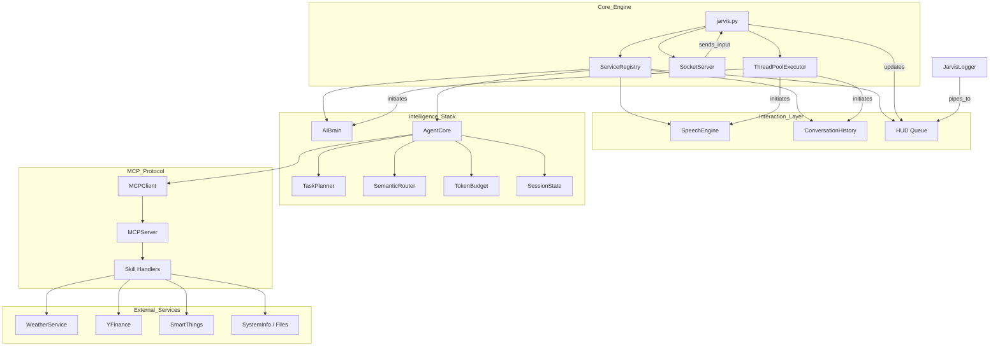

# Dependency Graph

## Structural Logic
1. **The Registry** is the central hub. All components depend on it for cross-module communication.
2. **AgentCore** orchestrates the high-level intelligence, depending on the **Brain** for reasoning and the **MCP Layer** for action.
3. **SpeechEngine** is the primary input/output gate for voice-based interaction.
4. **SocketServer** provides the bridge to the Swift-based visual interface (HUD).
